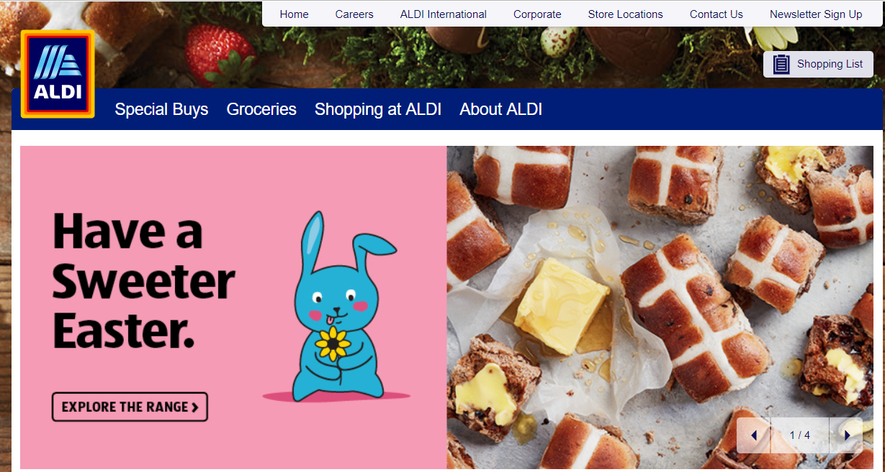
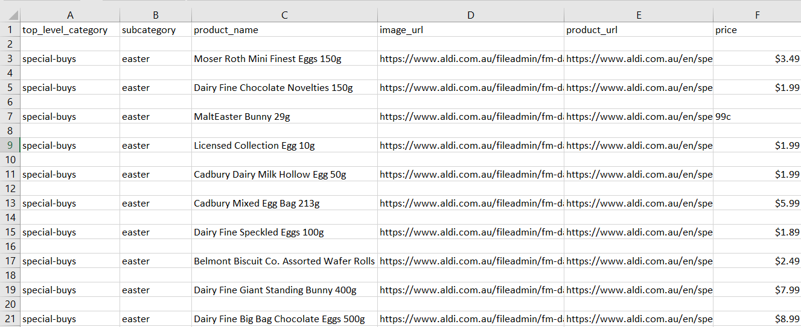

# web_scraping

This project mainly concentrates on scraping the ALDI website, which looks like below

The data is scraped by building a spider crawler using Python scrapy framework

* The code is present in the below extension:
        web_scraping/second_aldi/second_aldi/spiders/aldibot.py

* The output is saved in an csv.

* The output contains Top-category > sub-category > all the products (product image url, product url, product price and product name)

* The out contains the data of whole website.

* Below is the screenshot of the output. The csv file is available in below extension : web_scraping/second_aldi/aldi.csv

